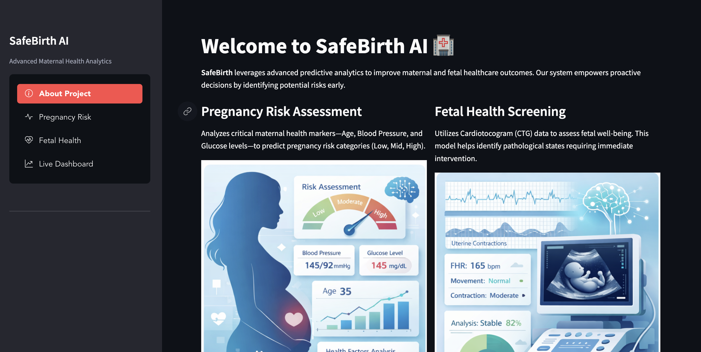
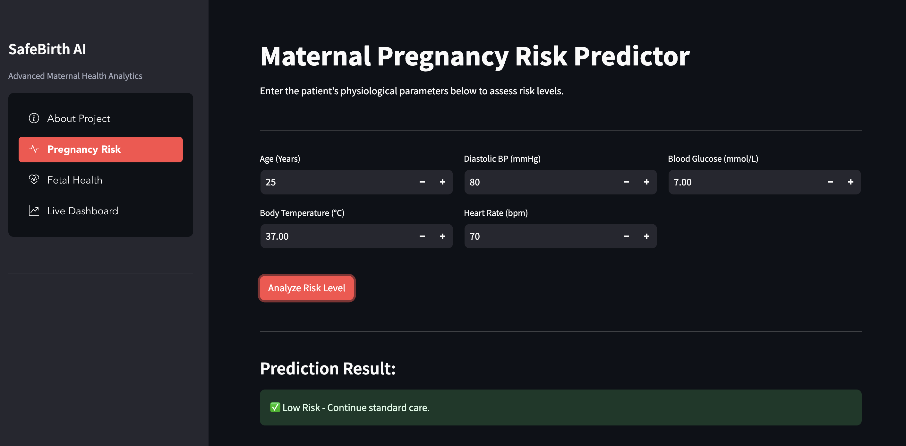
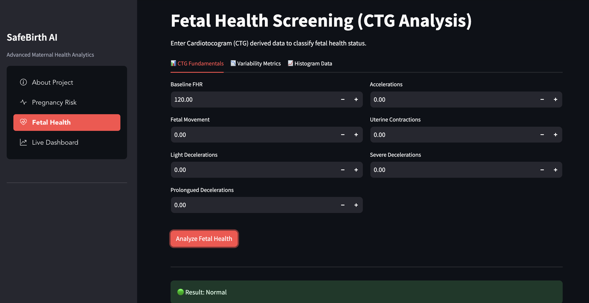
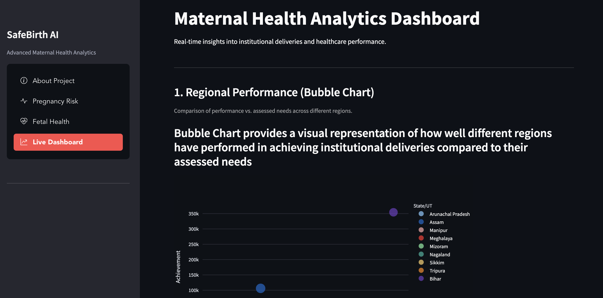

# SafeBirth - AI Maternal Health Assistant

## 🏥 Introduction
**SafeBirth** is an AI-powered platform designed to improve maternal and fetal healthcare outcomes. It empowers healthcare professionals with accurate risk predictions (Pregnancy Risk & Fetal Health) and provides a real-time analytics dashboard for monitoring institutional delivery performance.

---

## ✨ Key Features
* **Pregnancy Risk Prediction:** Uses Random Forest & Decision Trees to classify risk (Low/Medium/High) based on maternal vitals.
* **Fetal Health Screening:** Analyzes CTG data to identify fetal hypoxia or pathological states.
* **Interactive Dashboard:** Visualizes regional healthcare performance using real-time government data.

<p align="center">
     

</p>

<p align="center">
     

</p>

---

## 🛠️ Tech Stack
* **Python 3.10**
* **Streamlit** (Frontend)
* **Scikit-Learn** (ML Models)
* **Plotly & Pandas** (Data Visualization)

---

## 🚀 Quick Start

Run the following commands to set up the project locally. **Note:** Python 3.10 is required.

```bash
# 1. Clone the repository
git clone [https://github.com/sarthakgupta99/SafeBirth.git](https://github.com/sarthakgupta99/SafeBirth.git)
cd SafeBirth

# 2. Create and Activate Virtual Environment
python3.10 -m venv venv
source venv/bin/activate       # For Mac/Linux
# .\venv\Scripts\activate      # For Windows

# 3. Install Dependencies
pip install -r requirements.txt

# 4. Run the App
python -m streamlit run main.py